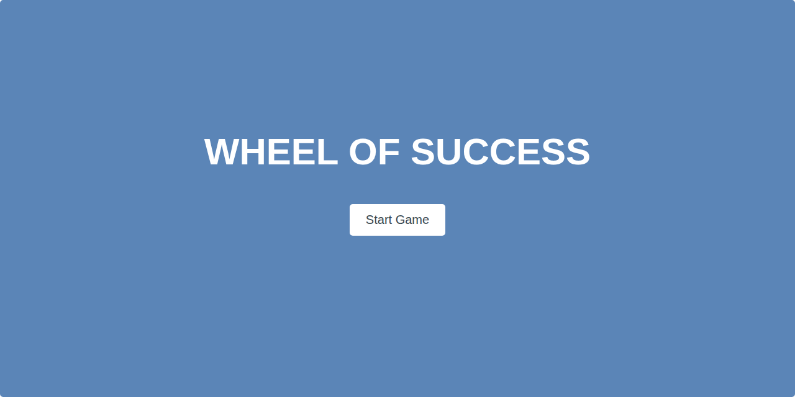

# Wheel of Success

A fun, interactive word-guessing game built with vanilla JavaScript. Players reveal hidden phrases by guessing letters before running out of lives.



[](https://brianwalkerdev.github.io/phrase-guessing-game-javascript-app)
[](LICENSE)

## 🎮 Live Demo

**[Play Now →](https://brianwalkerdev.github.io/phrase-guessing-game-javascript-app)**

## ✨ Features

- 🎲 Random phrase selection
- ⌨️ On-screen keyboard + physical keyboard support
- ❤️ 5-life system with visual feedback
- 📱 Fully responsive design
- ♿ Accessibility-friendly with ARIA labels
- 🔄 Instant game reset

## 🛠️ Tech Stack

- **HTML5** - Semantic markup
- **CSS3** - Custom properties, flexbox, smooth transitions
- **JavaScript (ES6)** - Pure vanilla JS, no frameworks
- **Node.js** - Build tooling only

## 🚀 Installation & Usage

```bash
# Clone the repository
git clone https://github.com/brianwalkerdev/phrase-guessing-game-javascript-app.git
cd phrase-guessing-game-javascript-app

# Option 1: Open directly in browser
open index.html

# Option 2: Run local server (requires Python 3)
npm start
```

Then visit `http://localhost:8080` and start playing!

## 📦 Deployment

### Build for Production

```bash
npm run build
```

This creates a `dist/` folder ready for deployment.

### Deploy Options

**GitHub Pages**
```bash
git subtree push --prefix dist origin gh-pages
```

**Netlify**
- Drag and drop the `dist/` folder to [Netlify Drop](https://app.netlify.com/drop)
- Or connect your repo for continuous deployment

**Vercel**
```bash
vercel --prod
```

The project is a static site with zero dependencies—easy to host anywhere!

## 📁 Project Structure

```
phrase-guessing-game-javascript-app/
├── index.html          # Main HTML file
├── css/                # Stylesheets
│   ├── styles.css      # Custom styles
│   └── normalize.css   # CSS reset
├── js/                 # Game logic
│   └── main.js         # Core JavaScript
├── images/             # Game assets
├── screenshots/        # Project thumbnails
├── scripts/            # Build script
└── package.json        # Project metadata
```

## 📄 License

MIT License - see [LICENSE](LICENSE) for details.

## 👤 Contact

**Brian Walker** - Entry-Level Developer

- Portfolio: [brianwalker.dev](https://brianwalker.dev)
- GitHub: [@brianwalkerdev](https://github.com/brianwalkerdev)
- Email: [brian@brianwalker.dev](mailto:brian@brianwalker.dev)

---

⭐ **Star this repo if you found it helpful!**
